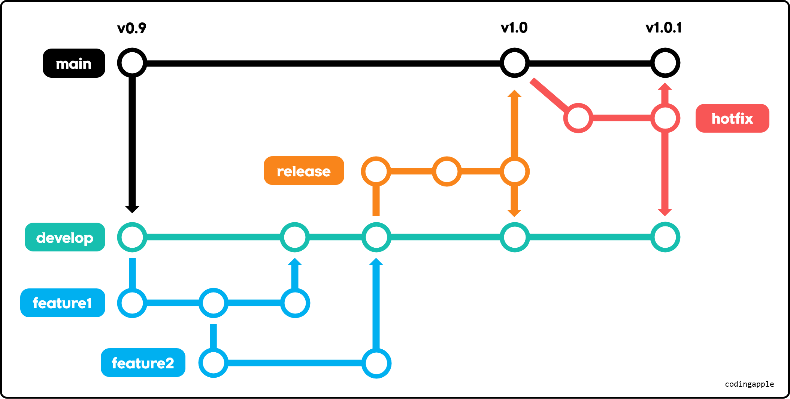
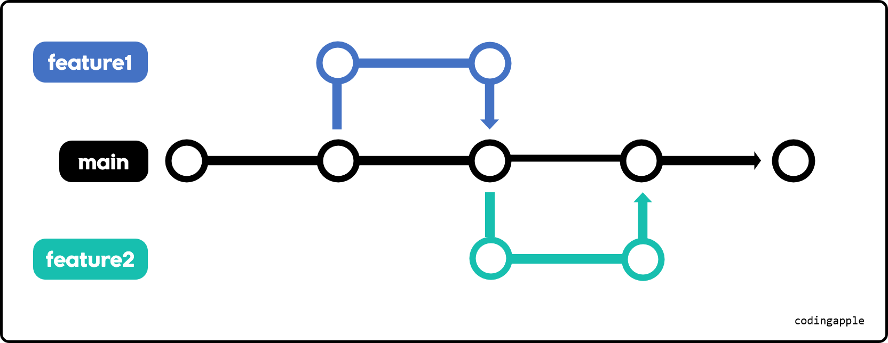

# powershell
$git config --global user.email "홍길동@naver.com"
$git config --global user "홍길동"

# 작업폴더에서 git 사용
$git init

# 파일 현재상태 기록
$git add 파일명
$

# 파일 현재상태 기록
$git add 파일명
$git commit -m '메모'

# staging
작업폴더 - [git add] - staging area - [git commit] - repository(저장소)

# 여러 파일 스테이징
$git add 파일1 파일2 ...

# 모든 파일 스테이징
$git add.
$

# git 상태 확인
$git status

# 스테이징된 파일 취소
$git restore --staged 파일명

# commit 내역 조회
$git log --all --oneline
$git log --all --oneline --graph
노란 문자들은 commit의 고유id 

# 최근 commit과 현재파일 차이점 
$git diff
$git difftool

# 특정커밋 비교가능
$git difftool 커밋id
$git difftool 커밋id1 커밋id2

# 브랜치 생성
$git branch 브랜치명

# 브랜치로 이동
$git switch

# merge
$git merge 브랜치명

# 브랜치 삭제
$git branch -D 브랜치명

# 3-way merge

일반적인 단순한 merge

# fast-forward merge

합칠 내용이 많지 않을 때 신규 브랜치를 main으로 만듬
new 브랜치 내용이 main과 합쳐서 새로 main 앞으로 이동
(싫을 경우 $git merge --no-ff)

# rebase & merge
브랜치의 시작점을 다른 commit으로 옮겨주는 행위
rebase를 이용해 신규 브랜치의 시작점을 main 브랜치 최근 commit으로 옮긴 뒤
fast-forward merge함
main branch log가 깔끔해짐

$git switch 새로운브랜치
$git rebase main

$git switch main
$git merge 새로운브랜치

# squash-merge

새 브랜치의 내용들이 main으로 텔레포트

$git switch main
$git merge --squash 새브랜치

# 다른 방식 merge 사용하는 이유
git log graph가 매우 복잡해지는 것을 방지

# 최근 commit 상태로 현재파일의 수정내역 되돌리기
$git restore 파일명

# 특정 커밋아이디 시점으로 복구
$ git restore --source 커밋아이디 파일명

# 특정 파일 staging 취소
$git restore --staged 파일명
$

# 특정 커밋 취소
$git revert 커밋아이디

# 최근 했던 commit 1개만 revert
$git revert HEAD 

# reset
$git reset --hard 커밋아이디
해당 커밋이 생성될 때로 버전을 돌려줌

# 변동사항 지우지 말고 스테이징해놓은 리셋
$git reset --soft 커밋아이디

# 변동사항 지우지 말고 unstage해놓은 리셋
$ git reset --mixed 커밋아이디

# Github

## repository (저장소)  
git이 파일 기록해두는 장소

## 온라인 repository (원격 저장소)만드는 이유  
자료 손실 방지  
협업가능

## 기본 브랜치 이름 main으로 변경
$git branch -M main

## 원격저장소 업로드
$git push -u 원격저장소주소 올릴로컬브랜치명  
-u : 주소를 기억하라

## 원격저장소 변수로 사용하여 업로드  
$git remote add 변수명 주소  
$git remote add origin 주소

## 원격저장소 내려받기
$git clone 원격저장소주소

## 저장소에 올리지 않는 파일 설정
.gitignore 파일을 만들어 올리지 않을 파일 명시가능  
git add . 해도 스테이징되지 않음  
ex) node_modules

## 원격저장소 -> 로컬저장소
$git pull 원격저장소주소 브랜치명  
$git pull origin 브랜치명

##원격저장소 최신내용이 로컬저장소에 있을 때만 git push 가능
git pull : git fetch + git merge  
git fetch : 원격저장소 신규 commit 가져오기  
git merge : 그걸 merge

## git pull 이후에 git push 하자

# 브랜치로 협업하기 (pull request)

## 브랜치 만들기
github 사이트에서 직접 생성  
로컬 저장소에서 생성하고 git push  
$git push 원격저장소주소 로컬브랜치명

## pull request
github.com 에서 브랜치를 merge하는 방법  
코드리뷰 댓글 가능  
merge 할 때 방법 (3-way, squash, rebase) 선택가능

# git flow / trunk-basesd 브랜치 전략

## GitFlow

main    
develop : 개발용    
feature : develop에 기능추가용    
release : develop 브랜치를 main 브랜치에 합치기 전 최종테스트용    
hotfix : main 브랜치 버그해결용      
  
main을 두고 여러 브랜치를 만들어서 기능추가, 테스트를 하고 마지막으로 main 브랜치에 합쳐서 배포  
안정적으로 버전별 배포가능

## Trunk-based

main 브랜치에서 새로운 브랜치를 만들어 기능추가, 버그픽스 등 함  
기능이 완성되면 main 브랜치에 합침  
main 브랜치의 코드를 필요할 때 마다 유저에게 배포  
  
테스트를 많이, 자주해야됨  
안정화된 프로젝트들이 많이 사용  
CI/CD에서 자주 사용  
CI(Continuous Integration) : 지속적 통합, 빌드/테스트 자동화 과정  
CD(Continuous Deployment) : 지속적 배포, 배포 자동화 과정  

# git stash로 코드 잠깐 보관하기

## 코드 보관하기
$git stash  
최근 commit과의 차이점을 전부 보관  
staging 안해놓은 새로운 파일은 stash 안될 수도 있음  

## 일부 코드만 보관하기
git stash -p

## 보관된 코드 목록 조회
$git stash list

## 메모와 함께 코드 보관하기
$git stash save '메모'

## 코드 불러오기
$git stash pop  
가장 최근 것 부터 불러옴

## stash 삭제
$git stash drop 번호 : stash 1개 삭제  
$git stash clear : stash 전부 삭제

## 하는 이유?
주석처리는 commit에 남기 때문에  
commit에 남지 않게 코드를 보관하고 싶을 때 사용  
브랜치를 따로 만들어서 코드를 보관해도 되긴함