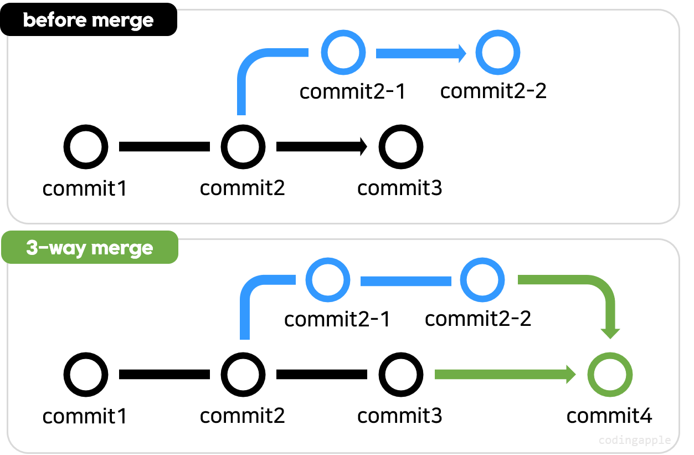
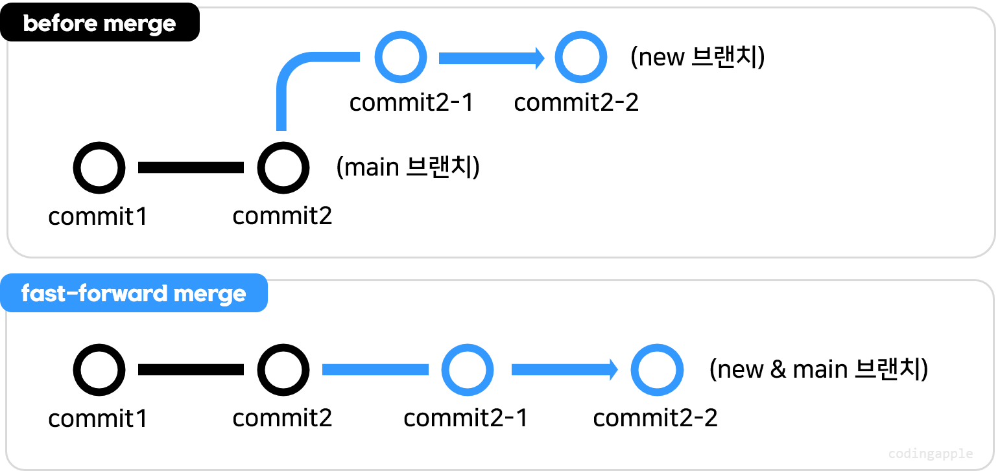
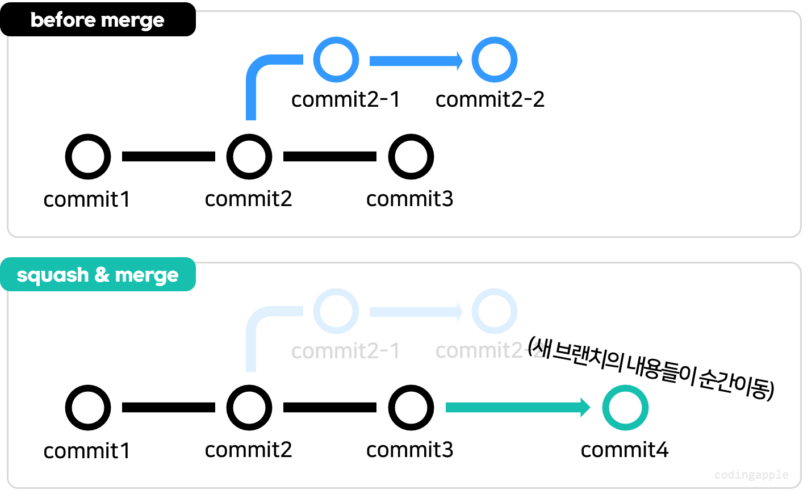

# powershell
$git config --global user.email "홍길동@naver.com"
$git config --global user "홍길동"

# 작업폴더에서 git 사용
$git init

# 파일 현재상태 기록
$git add 파일명
$

# 파일 현재상태 기록
$git add 파일명
$git commit -m '메모'

# staging
작업폴더 - [git add] - staging area - [git commit] - repository(저장소)

# 여러 파일 스테이징
$git add 파일1 파일2 ...

# 모든 파일 스테이징
$git add.
$

# git 상태 확인
$git status

# 스테이징된 파일 취소
$git restore --staged 파일명

# commit 내역 조회
$git log --all --oneline
$git log --all --oneline --graph
노란 문자들은 commit의 고유id 

# 최근 commit과 현재파일 차이점 
$git diff
$git difftool

# 특정커밋 비교가능
$git difftool 커밋id
$git difftool 커밋id1 커밋id2

# 브랜치 생성
$git branch 브랜치명

# 브랜치로 이동
$git switch

# merge
$git merge 브랜치명

# 브랜치 삭제
$git branch -D 브랜치명

# 3-way merge

일반적인 단순한 merge

# fast-forward merge

합칠 내용이 많지 않을 때 신규 브랜치를 main으로 만듬
new 브랜치 내용이 main과 합쳐서 새로 main 앞으로 이동
(싫을 경우 $git merge --no-ff)

# rebase & merge
브랜치의 시작점을 다른 commit으로 옮겨주는 행위
rebase를 이용해 신규 브랜치의 시작점을 main 브랜치 최근 commit으로 옮긴 뒤
fast-forward merge함
main branch log가 깔끔해짐

$git switch 새로운브랜치
$git rebase main

$git switch main
$git merge 새로운브랜치

# squash-merge

새 브랜치의 내용들이 main으로 텔레포트

$git switch main
$git merge --squash 새브랜치

# 다른 방식 merge 사용하는 이유
git log graph가 매우 복잡해지는 것을 방지

# 최근 commit 상태로 현재파일의 수정내역 되돌리기
$git restore 파일명

# 특정 커밋아이디 시점으로 복구
$ git restore --source 커밋아이디 파일명

# 특정 파일 staging 취소
$git restore --staged 파일명
$

# 특정 커밋 취소
$git revert 커밋아이디

# 최근 했던 commit 1개만 revert
$git revert HEAD 

# reset
$git reset --hard 커밋아이디
해당 커밋이 생성될 때로 버전을 돌려줌

# 변동사항 지우지 말고 스테이징해놓은 리셋
$git reset --soft 커밋아이디

# 변동사항 지우지 말고 unstage해놓은 리셋
$ git reset --mixed 커밋아이디